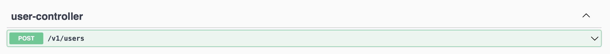
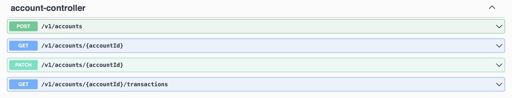
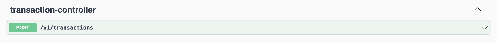

# Bank-ioBuilders

- [Bank-ioBuilders](#poc-iobuilders)
    - [Changelog](#changelog)
    - [Description](#description)
    - [Configuration](#configuration)
    - [Test & Build](#test--build)
    - [Run](#run)
    - [Architecture](#architecture)
      - [Domain-Driven-Design](#domain-driven-design)
      - [API Contract](#api-contract)
        - [Users](#users)
        - [Accounts](#accounts)
        - [Transactions](#transactions)
        - [Definitions](#definitions)
          - [RegisterUserRequest](#registeruserrequest)
          - [UserResponse](#userresponse)
          - [CreateAccountRequest](#createaccountrequest)
          - [AccountDepositRequest](#accountdepositrequest)
          - [AccountResponse](#accountresponse)
          - [AccountBalanceResponse](#accountbalanceresponse)
          - [AccountTransactionsResponse](#accounttransactionsresponse)
          - [TransactionRequest](#transactionrequest)
          - [TransactionResponse](#transactionresponse)
          - [TransactionsResponse](#transactionsresponse)
      - [Traceability](#traceability)
      - [Testing](#testing)
        - [Unit tests](#unit-tests)
        - [Acceptance tests](#acceptance-tests)


## Changelog

| DATE       | VERSION | STATUS |
|:-----------|:--------|:-------|
| 14/02/2022 | 1.0     | OK     | 

## Description

API proposal to simulate banking operations. The following are stated as requirements:

- User registration
- Account creation (wallet)
- Money deposit
- Display account (wallet)
  - Balance
  - Transactions
- Money transfer

This microservice is developed with Kotlin with SpringBoot as Framework.

## Configuration

| KEY                 | DEFAULT | DESCRIPTION                                      |
|:--------------------|:--------|:-------------------------------------------------|
| problem.stackTraces | false   | In order to include stackTraces in api responses | 
| server.port         | 8080    | Server HHTP port                                 | 


## Test & Build

This microservice has a code generator. 

To follow an API-First approach, the API specification based on OpenApiSpecification was created. 
In order to generate the code related to interfaces (ports in this case) and DTOs, once the project has been cloned, 
it must be built with the following command or using the Gradle plugins available for the different IDEs.

```
./gradlew build
```
## Run

```
./gradlew bootRun
```

Once the service is started you can access the swagger <http://localhost:8080/swagger-ui/index.html#/>

## Architecture


### Domain-Driven-Design

To use a DDD approach, the logic has been based on use cases that can be interpreted from the PoC requirements.

| REQUIREMENTS              | USESCASES                     | DESCRIPTION                                                                       |
|---------------------------|-------------------------------|-----------------------------------------------------------------------------------|
| User registration         | RegisterUserUseCase           | Offers user registration functionality in the system.                             |
| Account creation (wallet) | CreateAccountUseCase          | Offers the functionality of account creation for an existing user.                |
| Money deposit             | AccountDepositUseCase         | Offers the functionality of depositing money into an existing account.            |
| Display account           | AccountDisplayUseCase         | Offers the functionality of viewing balance and movements of an existing account. |
| Money transfer            | MoneyTransferUseCase          | Offers the functionality to transfer money from one existing account to another.  |
| 


### API Contract

In order to expose these functionalities, the following API contract has been created:

#### Users

In order to register an User:


> POST /v1/users

Parameters:

| TYPE | NAME | REQUIRED | SCHEMA                                      |
|------|------|----------|---------------------------------------------|
| Body |      | true     | [RegisterUserRequest](#registeruserrequest) |

Response:

| HTTP CODE | DESCRIPTION | SCHEMA                        |
|-----------|-------------|-------------------------------|
| 201       | CREATED     | [UserResponse](#userresponse) |


#### Accounts

In order to:
 - create an Account
 - make a deposit of money
 - display account balance
 - display account transactions



> POST /v1/accounts

Parameters:

| TYPE | NAME | REQUIRED | SCHEMA                                        |
|------|------|----------|-----------------------------------------------|
| Body |      | true     | [CreateAccountRequest](#createaccountrequest) |

Response:

| HTTP CODE | DESCRIPTION | SCHEMA                              |
|-----------|-------------|-------------------------------------|
| 201       | CREATED     | [AccountResponse](#accountresponse) |

> PATCH /v1/accounts/{accountId}

Parameters:

| TYPE | NAME      | REQUIRED | SCHEMA                                          |
|------|-----------|----------|-------------------------------------------------|
| Path | accountId | true     | string                                          |
| Body |           | true     | [AccountDepositRequest](#accountdepositrequest) |

Response:

| HTTP CODE | DESCRIPTION | SCHEMA                              |
|-----------|-------------|-------------------------------------|
| 200       | UPDATED     | [AccountResponse](#accountresponse) |

> GET /v1/accounts/{accountId}/balances

Parameters:

| TYPE | NAME      | REQUIRED | SCHEMA |
|------|-----------|----------|--------|
| Path | accountId | true     | string |

Response:

| HTTP CODE | DESCRIPTION | SCHEMA                                             |
|-----------|-------------|----------------------------------------------------|
| 200       | OK          | [AccountBalanceResponse](#accountbalanceresponse)  |

> GET /v1/accounts/{accountId}/transactions

Parameters:

| TYPE | NAME      | REQUIRED | SCHEMA |
|------|-----------|----------|--------|
| Path | accountId | true     | string |

Response:

| HTTP CODE | DESCRIPTION | SCHEMA                                                      |
|-----------|-------------|-------------------------------------------------------------|
| 200       | OK          | [AccountTransactionsResponse](#accounttransactionsresponse) |

#### Transactions

In order to create a transaction:


> POST /v1/transactions

Parameters:

| TYPE | NAME | REQUIRED | SCHEMA                                    |
|------|------|----------|-------------------------------------------|
| Body |      | true     | [TransactionRequest](#transactionrequest) |

Response:

| HTTP CODE | DESCRIPTION | SCHEMA                                      |
|-----------|-------------|---------------------------------------------|
| 201       | CREATED     | [TransactionResponse](#transactionresponse) |

#### Definitions

##### RegisterUserRequest

| PROPERTY  | REQUIRED | TYPE   |
|-----------|----------|--------|
| userName  | true     | string |
| firstName | false    | string |
| lastName  | false    | string |
| email     | false    | string |

##### UserResponse

| PROPERTY  | TYPE   |
|-----------|--------|
| userId    | string |
| userName  | string |
| firstName | string |
| lastName  | string |
| email     | string |

##### CreateAccountRequest

| PROPERTY  | REQUIRED | TYPE   |
|-----------|----------|--------|
| userId    | true     | string |

##### AccountDepositRequest

| PROPERTY               | REQUIRED | TYPE   |
|------------------------|----------|--------|
| amount                 | true     | number |

##### AccountResponse

| PROPERTY  | TYPE   |
|-----------|--------|
| accountId | string |
| iban      | string |
| owner     | string |
| amount    | number |

##### AccountBalanceResponse

| PROPERTY  | TYPE   |
|-----------|--------|
| accountId | string |
| iban      | string |
| balance   | number |

##### AccountTransactionsResponse

| PROPERTY     | TYPE                 |
|--------------|----------------------|
| accountId    | string               |
| transactions | TransactionsResponse |


##### TransactionRequest

| PROPERTY             | REQUIRED | TYPE   |
|----------------------|----------|--------|
| amount               | true     | number |
| destinationAccountId | true     | string |
| originAccountId      | true     | string |

##### TransactionResponse

| PROPERTY             | TYPE   |
|----------------------|--------|
| transactionId        | string |
| amount               | number |
| destinationAccountId | string |
| originAccountId      | string |
| transactionDate      | string |

##### TransactionsResponse

| PROPERTY               | TYPE                     |
|------------------------|--------------------------|
| results                | string                   |
| transactions           | transactionResponse list |


#### Zalando: problem-spring-web


Zalando's problem-spring-web has been implemented to handle error responses.

This further simplifies error handling, reducing the amount of code.

It also allows the extension of the response with stackTraces by modifying the property in application.yaml


## Traceability

Sleuth provides everything necessary to carry out traceability, propagating the trace through the services and being able to be collected by a Zipkin server that would allow its registration.

## Testing
### Unit Tests

Unit tests have been developed to cover the different functionalities. 

Currently, the coverage is as follows:


### Acceptance Tests

